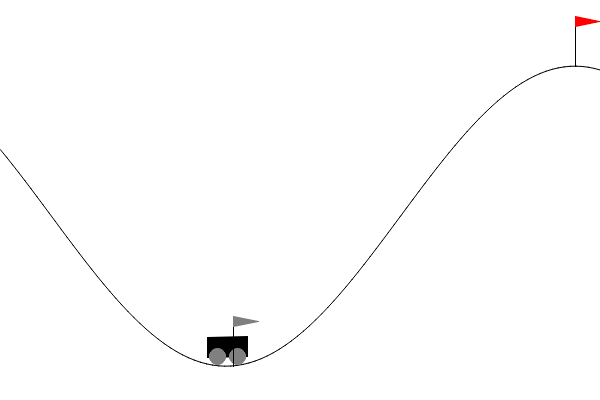
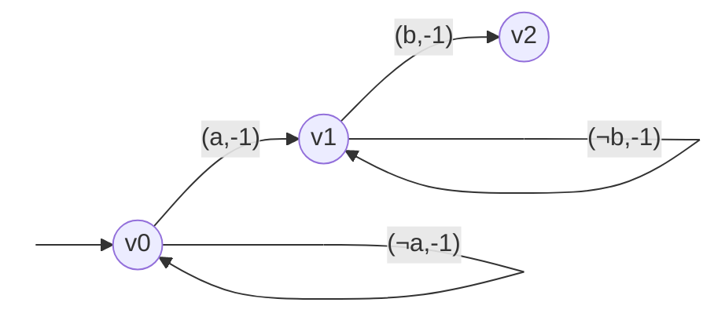
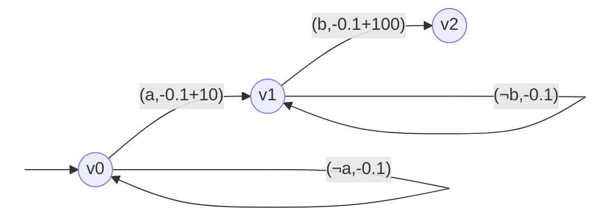
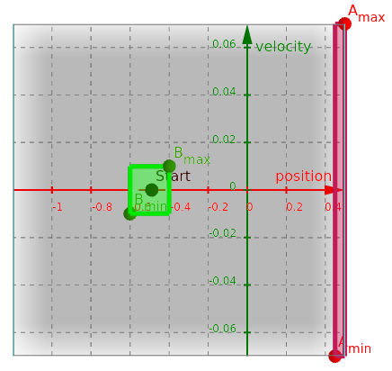

# Using Reward Machines to Solve Long Horizon Planning Tasks via Reinforcement Learning

> This is the course project for _ASE389: Verification and Synthesis for Cyberphysical Systems_ -- Spring 2022

The specificity of this branch is the Reward Machine inference (`--obs=2`).
This codes uses parts of https://github.com/u-t-autonomous/JIRP-AdvisoRL (for automata inference).


## Installing

We used python 3.7 and the libraries in [`requirements.txt`](requirements.txt).

```sh
pip install --upgrade -r requirements.txt
```

The following apt-get packages might be necessary:
`libjpeg62 pkg-config libhdf5-100 libhdf5-dev`

## Running the code

For a quick demo, run:
```sh
./main.py --eval-render --seed=2 --train-iter=100000 --obs=2 --RM=0 --gamma=1 SarsaLambda --lambda=0.95 --alpha=0.1 TileCoding
```
Also, the learned reward machine is updated in real time in `learned.dot`
(it is recommended to monitor it with a software such a `xdot`).



Help messages are available:
<!----------------------------------------------------------------------------->
<details open>
<summary><code>./main.py --help</code></summary>
<p>

```
usage: main.py [-h] [--discrete-actions {0,1}] [--observable-RM {0,1,2}]
               [--RM ID] [--gamma FLOAT] [--seed INT] [--train-iterations INT]
               [--eval-episodes INT] [--eval-iterations INT] [--train-render]
               [--eval-render] [--save-train PATH] [--save-eval PATH]
               ALGO ...

optional arguments:
  -h, --help            show this help message and exit

environment parameters:
  --discrete-actions {0,1}
                        If true (default), the agent uses discrete actions, if
                        false, it uses continuous actions.
  --observable-RM {0,1,2}
                        Makes the Reward Machine observable by the agent (0:
                        no, 1: yes (given), 2: infer RM)
  --RM ID               Preconfigured Reward machine and Stops: 0 is (R=-1,
                        Ra=0, Rb=0), 1 is (R=-0.1, Ra=10, Rb=100)
  --gamma FLOAT         discount factor

training parameters:
  --seed INT            seed for generating random numbers
  --train-iterations INT
                        total timesteps to train on (cumulative between
                        episodes) (default 100000)
  --eval-episodes INT   total evaluation episodes (default 100)
  --eval-iterations INT
                        max timesteps per evaluation episode (default 1000)
  --train-render        render the environment at 120 fps during training
  --eval-render         render the environment at 120 fps during evaluation
  --save-train PATH     Save the training logs as a pickle file (.pkl)
  --save-eval PATH      Save the evaluation logs as a pickle file (.pkl)

algorithms:
  ALGO                  algorithm to use
    NStepSarsa          Episodic n-step Semi-gradient Sarsa.
    SarsaLambda         True Online Sarsa(lambda).
```

`--RM=0` corresponds to the Reward Machine:


`--RM=1` corresponds to the Reward Machine:


The chosen Reward Machine synchronises whith the environment through the labels
`a` () and
`b` ().



</p>
</details>
<!----------------------------------------------------------------------------->
<details>
<summary><code>./main.py NStepSarsa --help</code></summary>
<p>

```
usage: main.py NStepSarsa [-h] --n INT --alpha FLOAT Q ...

Episodic n-step Semi-gradient Sarsa.

optional arguments:
  -h, --help     show this help message and exit

algorithm parameters:
  --n INT        steps
  --alpha FLOAT  step size

value function approximators:
  Q              Q-function approximator to use
    TileCoding   Q function approximator with Tile Coding.
    Network      Q function approximator with Neural Network.
```
</p>
</details>
<!----------------------------------------------------------------------------->
<details>
<summary><code>./main.py SarsaLambda --help</code></summary>
<p>

```
usage: main.py SarsaLambda [-h] --lambda FLOAT --alpha FLOAT Q ...

True Online Sarsa(lambda).

optional arguments:
  -h, --help      show this help message and exit

algorithm parameters:
  --lambda FLOAT  decay rate
  --alpha FLOAT   step size

value function approximators:
  Q
    TileCoding    Q function approximator with Tile Coding.
```
</p>
</details>
<!----------------------------------------------------------------------------->
<details>
<summary><code>./main.py NStepSarsa TileCoding --help</code></summary>
<p>

```
usage: main.py NStepSarsa TileCoding [-h] [--save-model PATH]
                                     [--load-model PATH]

Q function approximator with Tile Coding.

optional arguments:
  -h, --help         show this help message and exit
  --save-model PATH  Save the weight vector as a numpy file (.npy)
  --load-model PATH  Load the weight vector and skip training

TileCoding fixed parameters are tile_width = [.45,.035], num_tilings = 10.
```
</p>
</details>
<!----------------------------------------------------------------------------->
<details>
<summary><code>./main.py NStepSarsa Network --help</code></summary>
<p>

```
usage: main.py NStepSarsa Network [-h] --RMenc {OneHot,Linear,NNs}

Q function approximator with Neural Network.

optional arguments:
  -h, --help            show this help message and exit

Neural Network parameters:
  --RMenc {OneHot,Linear,NNs}
                        NNs: one NN per RM state; otherwise, encode RM state
                        as input neuron(s) (1 or one-hot).

Neural Network fixed parameters are hidden_layers = 2 neurons_per_hidden_layer
= 32
```
</p>
</details>
<!----------------------------------------------------------------------------->


Example of runs (optimal parameters presented in the project report):

```sh
./main.py --eval-render --obs=1 --RM=0 --gamma=1 NStepSarsa --n=8 --alpha=0.05 TileCoding
./main.py --eval-render --obs=1 --RM=0 --gamma=1 NStepSarsa --n=8 --alpha=0.0001 Network --RMenc=NNs
./main.py --eval-render --obs=1 --RM=0 --gamma=1 SarsaLambda --lambda=0.95 --alpha=0.1 TileCoding
```
Use `--obs=0` (shortcut for `--observable-RM=0`) to test non observable Reward Machines. Set `--seed` to reproduce the results.

<!-- Already trained models can be found in `models/`, for methods that support `--save-model`. -->
Certain methods allow to save a model after training, using `--save-model`. 
One can load these models for evaluation, instead of training a new model, with the argument `--load-model`.
When loading a model, other arguments should be the same as the one used to save the model, in particular the environment definition (`--discrete-actions`, `--observable-RM`).

## Other files

`test_DRL.py` (for SAC) and `run*.py` (for Sarsa algorithms) were used for grid search.
One might need to change the code to change the tested parameters.

The notebook `tests.ipynb` provides codes snippets that we used to generate the figures.

